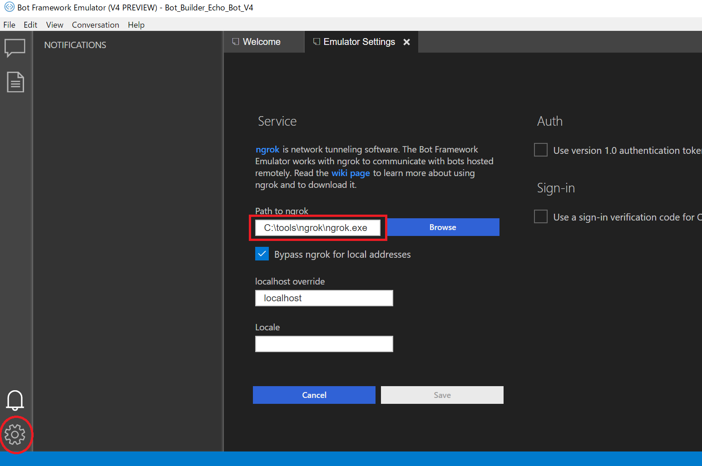

# 00. 環境準備

## Visual Studio 2017

開発のベースとなる IDE です。エディションは不問です。最新の状態に更新しておきましょう。

## .NET COre 2.x

Bot Builder V4 は、.NET Core 2.0 以上の環境で動作します。  
[公式サイト](https://www.microsoft.com/net/download)から、SDK と Runtime の両方をダウンロード・インストールしましょう。

## Bot Builder V4 SDK Template for Visual Studio

Visual Studio 2017 でプロジェクトを作成する際のテンプレートです。

[公式サイト](https://marketplace.visualstudio.com/items?itemName=BotBuilder.botbuilderv4)からダウンロード・インストールしましょう。

> インストール時は、Visual Studio 2017 の停止する必要があります。

## Bot Emulator

開発したチャットボットにアクセスする（話しかける）際に利用するエミュレーターです。

#### Bot Emulator のインストール

[公式リポジトリー](https://github.com/Microsoft/BotFramework-Emulator/releases)から最新バージョンをインストールしましょう。

> Windows の場合 botframework-emulator-Setup-{version}.exe をダウンロードしてインストールします。

#### ngrok のインストールとセットアップ

ngrok を[公式サイト](https://ngrok.com/)からダウンロードし、任意のフォルダに実行ファイル（ngrok.exe）を配置します。

> ngrok の実行ファイルのパスを Bot Emulator から指定して利用しますので、適切なフォルダに配置しましょう。

Bot Emulator を起動し、左下の設定ボタンをクリック > 「Path to ngrok」に ngrok の実行ファイルのパスを入力 > `Save` ボタンをクリックして保存します。

以上でセットアップは終了です。次は、チャットボットのプロジェクトを作成します。

--

[Back](README.md) | [Next](01_Create_Project.md)
